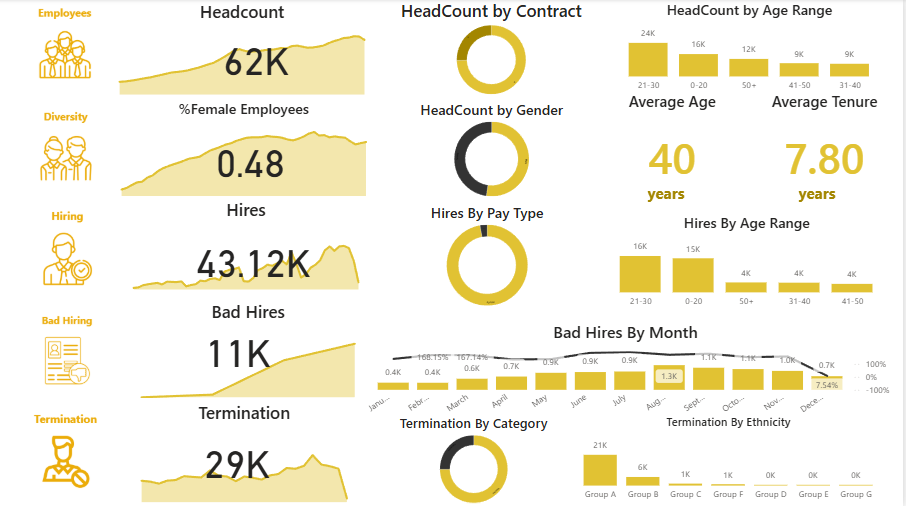
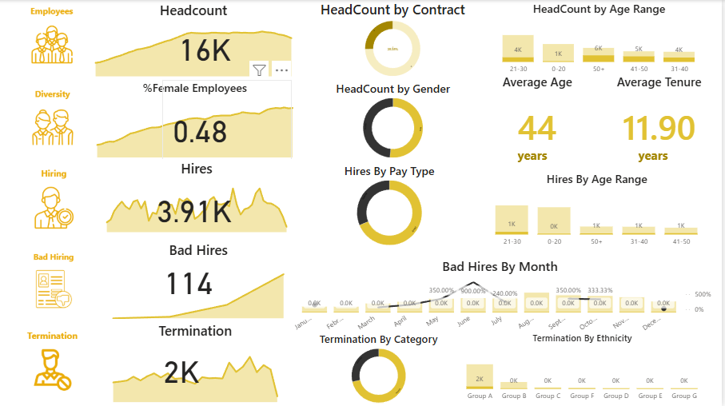
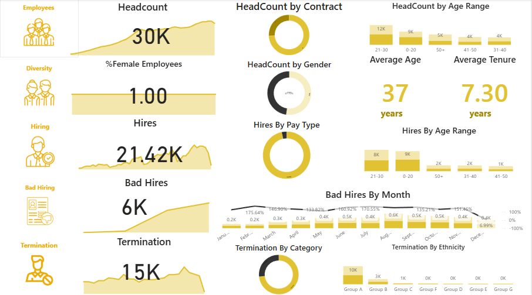
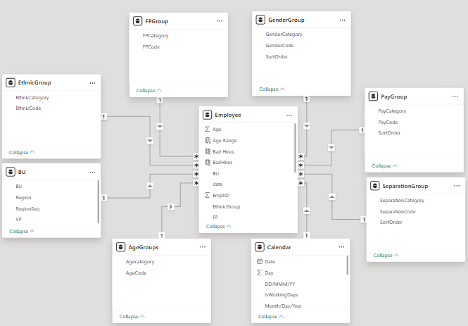

# HR Analytics Dashboard 📊

## პროექტის შესახებ
ამ პროექტის მიზანია 62,000-ზე მეტი თანამშრომლის მონაცემების ანალიზი, კადრების დენადობის ტენდენციების დადგენა და არაეფექტური დაქირავების პატერნების გამოვლენა.

## გამოყენებული ინსტრუმენტები 🛠️
* **Power BI:** მონაცემთა მოდელირება და ინტერაქტიული ვიზუალიზაცია.
* **Excel / Power Query:** მონაცემთა გაწმენდა და სისტემატიზაცია.

## მთავარი ინსაითები 💡
* გამოვლინდა 11,000-მდე არაეფექტური დაქირავების შემთხვევა.
* გაანალიზდა კადრების დენადობის ტენდენციები და დაქირავების ეფექტურობა, რაც HR დეპარტამენტს მონაცემებზე დაფუძნებული გადაწყვეტილებების მიღებაში ეხმარება.

## დეშბორდის ვიზუალი 📸

